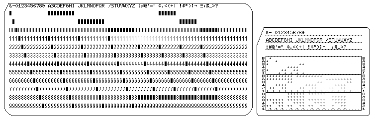

# Ask your grandpa again - Challenge 173

This is a FORTAN program.

Just like challenge 172, let's decode all files manually using this:



The numbers on the right of each line are the sequence numbers.

So once we put the lines in order we end up with:

``` fortran
program wflag
    I=931
    J=2800
    WRITE(6,1337)J+29,(J/4)+20,I
    1337 FORMAT(11HFLAG-DFEB0D,I4,1H-,I3,10HFDBECDF39D,I3)
end
```

I used https://www.tutorialspoint.com/compile_fortran_online.php to run the program and get the flag.
