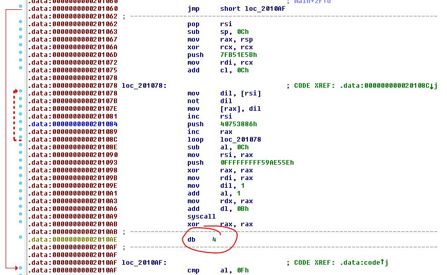

# Execute me if you can again - Challenge 125

As with challenge 121, the shellcode is dynamic so it changes with every page refresh. This time though we can't just download the shellcode and run it as we get a segmentation fault.

Here's an example of a shellcode for this challenge:

```
\xeb\x4d\x5e\x66\x83\xec\x0c\x48\x89\xe0\x48\x31\xc9\x68\x5b\x1e\xb5\x7f\x48\x89  
\xcf\x80\xc1\x0c\x40\x8a\x3e\x40\xf6\xd7\x40\x88\x38\x48\xff\xc6\x68\x86\x38\x75   
\x40\x48\xff\xc0\xe2\xea\x2c\x0c\x48\x89\xc6\x68\x5e\xe5\x9a\xf5\x48\x31\xc0\x48  
\x89\xc7\x40\xb7\x01\x04\x01\x48\x89\xc2\x80\xc2\x0b\x0f\x05\x48\x31\xc0\x04\x3c  
\x0f\x05\xe8\xae\xff\xff\xff\xca\xab\xa6\xc7\xa9\xca\xb8\xca\x89\x97\xb8\xcf\xa2  
\x33\x76\xd5\xfd\xa4\xa4\xdf\x68\x96\x4a\xeb\x70\x5b\x52\x41\x4e\x44\x53\x54\x52  
\x32\x5d
```

I'm not very good at assembly so what I did is compare the shellcode from this challenge with the one from challenge 121 and noticed that some of the code doesn't seem to decode properly in IDA. The instruction at 20109E is also different.



So with a little bit of experimentation and HxD I changed `\x40\xb7\x01\x04\x01` for `\x04\x01\x48\x89\xc2` at 20109E and was able to successfully run the shellcode.


[challenge125.py](challenge125.py)
