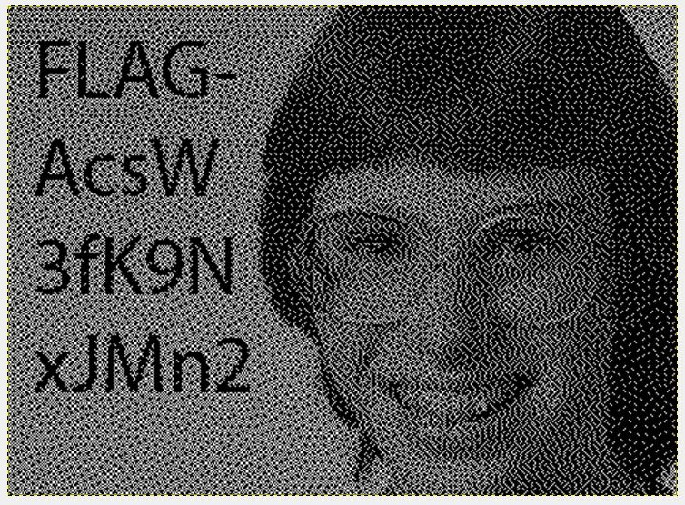

# Fashion victim - Challenge 156

#1. Used the following script to extract each individual frame:

``` python
import os
from PIL import Image

def extractFrames(inGif, outFolder):
    frame = Image.open(inGif)
    nframes = 0
    while frame:
        frame.save( '%s/%s-%s.gif' % (outFolder, os.path.basename(inGif), nframes ) , 'GIF')
        nframes += 1
        try:
            frame.seek( nframes )
        except EOFError:
            break;
    return True

extractFrames('tv.gif', '.')
```

#2. Hashed all images and discarded the ones that were identical:

`for filename in *.gif; do md5sum $filename; done`

#3. Create a new image in GIMP with layers and loaded each image on a separate layer

#4. Then played with layer visible option until I found the flag (I did this one manually, I should have written a script to create a new image for every possible layer permutation)


