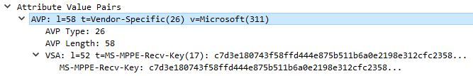
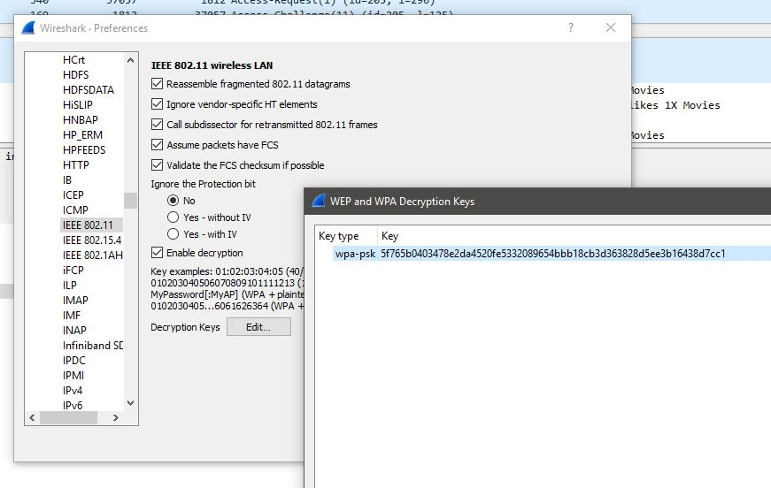
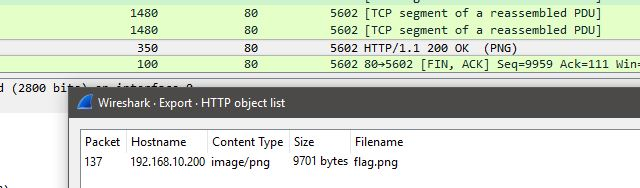

# 802.1x part 2 - Challenge 193

If you have the RADIUS shared secret and can capture packets between the RADIUS server and the AP then you can obtain the PMK and decrypt all user traffic. We already have the shared secret and the packets between the AP and the RADIUS server so we're all set. The hard part was extracting the PMK from the packets we have. Fortunately, Alec Waters already put together a tool to do this:

https://wirewatcher.wordpress.com/2011/01/23/tweaking-eaps-weak-link-sucking-wifi-pmks-out-of-radius-with-pmkxtract/

Source code for tool extract the PMK: http://www.wirewatcher.net/files/pmkxtract.cpp

To get the PMK, we need the following:
* Shared secret (obtained on last challenge)
* MS-MPPE-Recv-Key (packet #20)
* Authenticator from last Access-Request (packet #19)



Then we use the pmkxtract program provided in the link above.

```
C:\Users\Administrator>pmkxtract karaoke b9:3e:45:c0:93:9d:c4:81:cd:5b:3a:f4:7a:
c0:30:87 c7:d3:e1:80:74:3f:58:ff:d4:44:e8:75:b5:11:b6:a0:e2:19:8e:31:2c:fc:23:58
:12:a8:82:b4:b9:e0:36:a3:59:e5:aa:1e:6d:6b:93:30:9a:1a:75:79:90:bf:a9:85:80:84
PMK is:
5f765b0403478e2da4520fe5332089654bbb18cb3d363828d5ee3b16438d7cc1
```

Good, so we have the PMK : __5f765b0403478e2da4520fe5332089654bbb18cb3d363828d5ee3b16438d7cc1__
Now we set up the decryption of traffic in Wireshark:



There's a flag image in the data, let's extract it then we got the flag.


