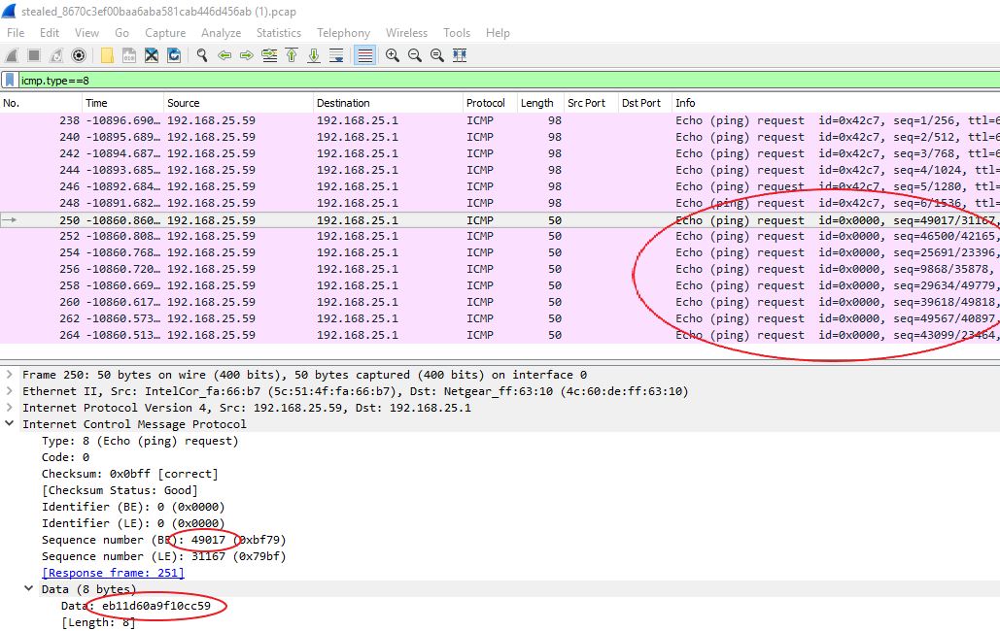

# Someone steal my flag again - Challenge 150

The interesting bits are stored in the ICMP request payload and sequence number

I copy/pasted those from Wireshark into the script.

We need to XOR the payload with the sequence number in each packet to get the plaintext

[challenge150.py](challenge150.py)
