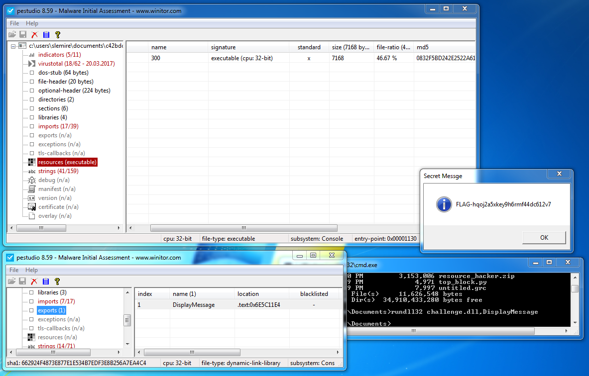

# Crack me 1 - Challenge 9

When we open the .exe file in PEstudio we see that there is an executable resource inside the file.

So we'll use Resource Hacker to extract the binary to a .dll, open it up in PEstudio and check the exports. DisplayMessage is exported so we'll just execute the .dll and call that function.

