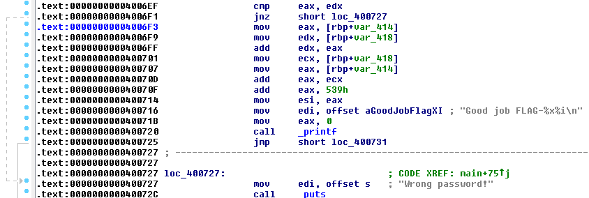

# Crack me 2 - Challenge 36

This looks like challenge 9 where we have an executable that asks for a password and returns the flag if the right password is provided.

```
root@kali:~# file 922cb8ea8a0ef26b7cd18388b10fd70d
922cb8ea8a0ef26b7cd18388b10fd70d: ELF 64-bit LSB executable, x86-64, version 1 (SYSV), dynamically linked, interpreter /lib64/ld-linux-x86-64.so.2, for GNU/Linux 2.6.24, BuildID[sha1]=a8506f74ea3e33947fe37f49a8a38e3c86dc000a, not stripped
```

```
root@kali:~# ./922cb8ea8a0ef26b7cd18388b10fd70d
Password:AAAAAA
Wrong password!
```

When we look at the disassembled code, we can see at 0x4006F1 a branching instruction that'll jump to the section where 'wrong password' is displayed. If we skip over this instruction we can most likely get the flag.



We'll need to change the JNZ instruction at 0x4006F1 to a NOP. Let's use HxD to edit the file:


Then we run the file, enter any invalid password and we get the flag:

```
root@kali:~# ./cracked
Password:boom
Good job FLAG-6f749f251869912556
```
