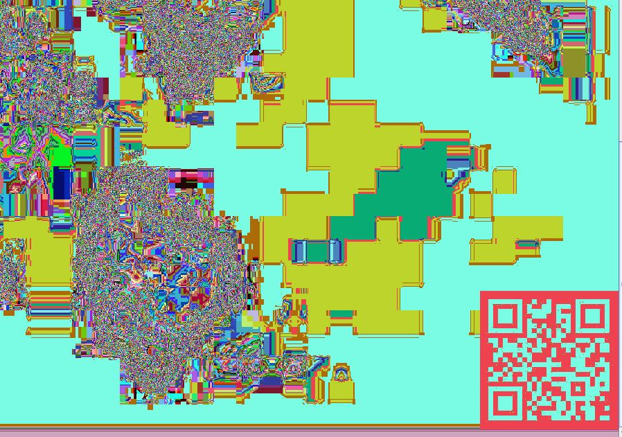
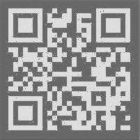

# Missing pieces - Challenge 129

No other file seems to be hidden in this picture:

```
root@kali:~# binwalk b730986ccddd83b5f6fb66d2ec362475.jpeg

DECIMAL       HEXADECIMAL     DESCRIPTION
--------------------------------------------------------------------------------
0             0x0             JPEG image data, JFIF standard 1.01
```

Next, let's try stegsolve and see if we can find anything interesting.





Good, a QR code, we scan it and we find the flag.
