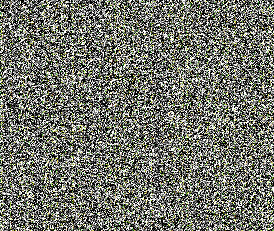
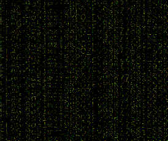
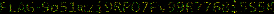

# Pixels everywhere - Challenge 194

I used the hint for this one...

1. Loaded up GIMP then converted white and black to alpha
2. Added a black background
3. Then merged sets of 12 pixels high blocks on top of each other until I was able to read enough of the words

`FLAG-9a51mzi*********************`

Before:

After:

Our flag after overlaying enough pixels:

