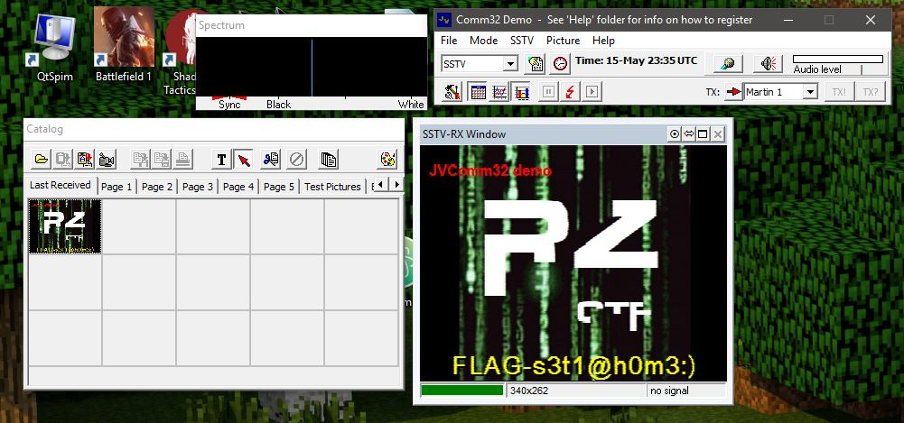

# Vestige of dialup internet - Challenge 244

Wow, I couldn't figure this one out. I was sure that we had to decode a 300 baud modem transmission or something. Had to buy a hint to solve it.

This is an SSTV signal:

> Slow Scan television (SSTV) is a picture transmission method used mainly by amateur radio operators, to transmit and receive static pictures via radio in monochrome or color.
A literal term for SSTV is narrowband television. Analog broadcast television requires at least 6 MHz wide channels, because it transmits 25 or 30 picture frames per second (in the NTSC, PAL or SECAM color systems), but SSTV usually only takes up to a maximum of 3 kHz of bandwidth. It is a much slower method of still picture transmission, usually taking from about eight seconds to a couple of minutes, depending on the mode used, to transmit one image frame. (wikipedia.org)

I used JVComm32 (http://www.jvcomm.de/index_e.html) to decode the .wav file and recover the flag.

