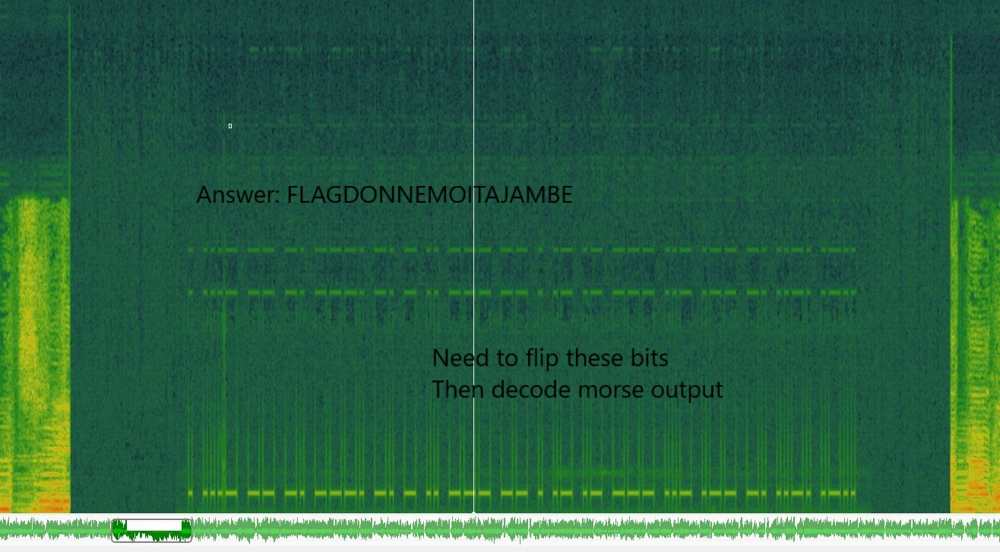

## 	Your old friend Orloge Simard - Challenge 106

I used Sonic Visualizer (http://www.sonicvisualiser.org/) to find morse code in the file.

The morse code is backward, you just need to reverse each code then you easily find the flag

