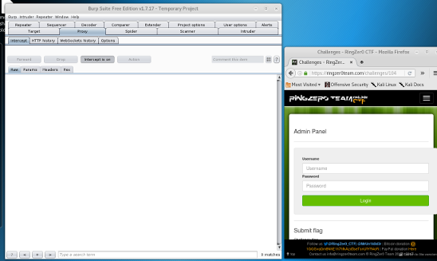
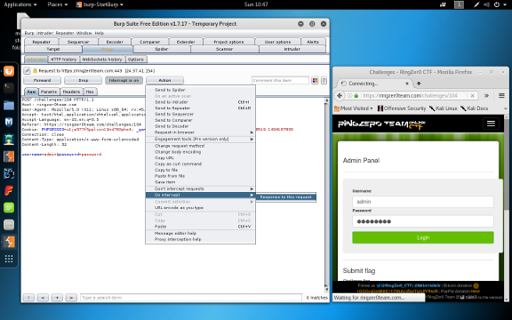
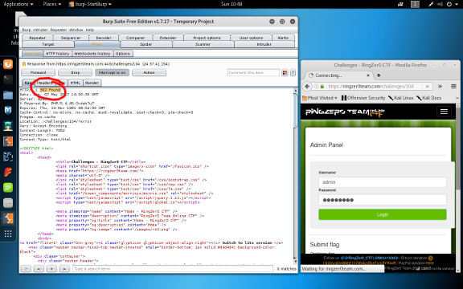
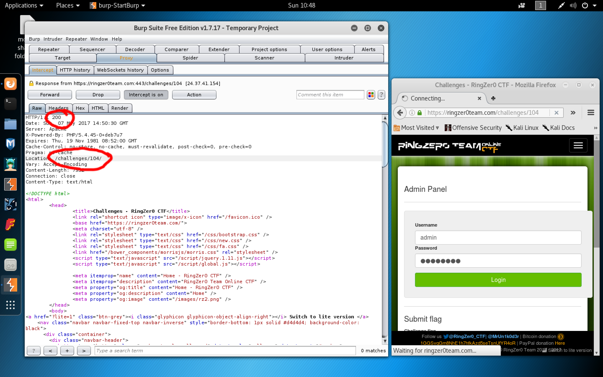
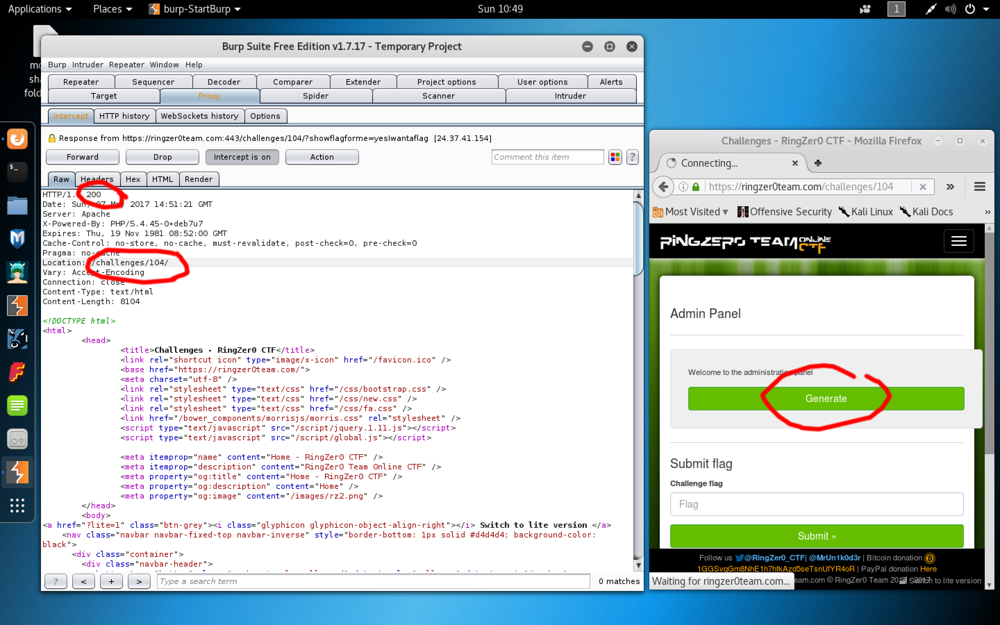
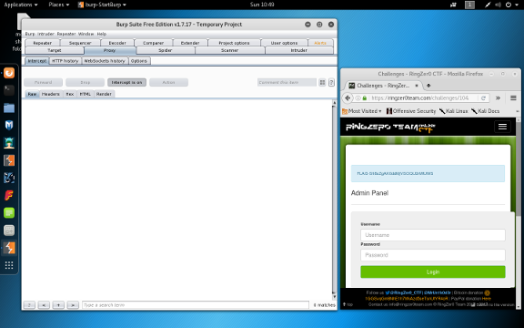

# Admin panel - Challenge 104

The HTTP redirection on this page is insecure

Let's use Burp Suite to manipulate the HTTP response codes and change that 302 to a 200

Enable interception on the proxy in Burp Suite then set up your browser to use the local proxy

Send your POST request to the challenge form, then enable interception of the response

Change the 302 to a 200, then forward the request back

We now get a new page with an hidden field in the form

We'll do the same thing, swap the 302 for 200 and get the flag

